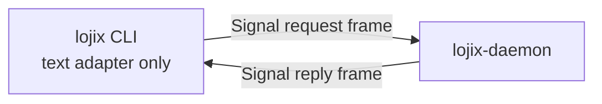

# signal-lojix — architecture

*Typed Signal contract for the lojix deploy orchestrator.*

> **Status:** contract + typed configuration slice on
> `horizon-leaner-shape`. The crate defines typed deploy,
> cache-retention, generation-query, observation-stream, and
> `nota-config` startup configuration records, declares the
> `signal-frame` channel with contract-local operation verbs, and
> exposes Nix-backed round-trip and boundary tests.

## Migration history — contract-local verbs

The channel uses contract-local operation verbs per
`primary/reports/designer/241-signal-architecture-migration-guide.md`:
`Deploy` (was `Assert DeploymentSubmission`), `Pin`/`Unpin`/`Retire`
(split from `Mutate CacheRetentionRequest` so the three actions surface
as distinct public operations), `Query` (was `Match GenerationQuery`),
`WatchDeployments` + `UnwatchDeployments` and `WatchCacheRetention` +
`UnwatchCacheRetention` (was the `Subscribe`/`Retract` pair per
stream). Verb-to-Sema lowering moves into the `lojix-daemon` executor;
this contract no longer declares Sema-side intent. The dependency on
`signal-core` shifted to `signal-frame`; no dependency on `signal-sema`
since lojix does not speak Sema directly on its public surface.

## 0 · TL;DR

`signal-lojix` is the public vocabulary for cluster deploy
orchestration. It defines the typed request/reply records exchanged
between operator clients and the long-lived `lojix-daemon` binary in
the `lojix` repo over the daemon's Unix socket.

This repo owns records, validation newtypes, rkyv round trips, NOTA
round trips, typed startup configuration records, and channel shape. It
does not own the daemon implementation, CLI behavior, storage tables,
actors, socket lifecycle, or the actual deploy pipeline.

> **Scope (eventual vs today).** This contract sits on today's stack:
> `signal-core` wire, rkyv archives, and `sema-engine` storage in
> consumers. The eventually-self-hosting stack is Sema-on-Sema; this
> contract is a realization step. See `~/primary/ESSENCE.md` §"Today
> and eventually".

## 1 · Channel Boundary

| Side | Component |
|---|---|
| Request producer | `lojix` CLI, future operator clients |
| Request consumer | `lojix-daemon` |
| Reply producer | `lojix-daemon` |
| Reply consumer | the caller that submitted the operation |

Transport: Unix socket at `/run/lojix/daemon.sock` carrying
`signal-core` frames. The transport itself belongs to `lojix`, not
this contract.

The human-facing `lojix` CLI is only a text adapter for this channel.
It decodes one NOTA `Request`, sends it over the daemon socket, renders
one NOTA `Reply`, and exits. It does not own Horizon projection, Nix
invocation, GC-root updates, deployment ledgers, sema state, or any
other effect-bearing deploy action. Those actions are daemon-owned and
are reached only by sending typed `signal-lojix` requests to
`lojix-daemon`.

For the human-facing CLI, the channel has exactly one peer:
`lojix-daemon`.



No CLI-to-Horizon relationship exists in this contract. Paths to
pan-Horizon configuration, cluster proposals, flakes, builders, or
deploy plans are data-plane payload content for daemon-owned handlers,
not CLI-owned peers or configuration.

## 2 · Channel Surface

The implemented channel has one `signal_channel!` declaration. It is a
streaming channel because deployment and cache-retention observations are
daemon-pushed events, not delayed request/reply payloads:

```rust
signal_channel! {
    channel Lojix {
        request Request {
            Assert DeploymentSubmission(DeploymentSubmission),
            Mutate CacheRetentionRequest(CacheRetentionRequest),
            Match GenerationQuery(GenerationQuery),
            Subscribe DeploymentObservationSubscription(DeploymentObservationSubscription)
                opens DeploymentObservationStream,
            Subscribe CacheRetentionObservationSubscription(CacheRetentionObservationSubscription)
                opens CacheRetentionObservationStream,
            Retract DeploymentObservationRetraction(DeploymentObservationToken),
            Retract CacheRetentionObservationRetraction(CacheRetentionObservationToken),
        }
        reply Reply {
            DeploymentAccepted(DeploymentAccepted),
            DeploymentRejected(DeploymentRejected),
            CacheRetentionAccepted(CacheRetentionAccepted),
            CacheRetentionRejected(CacheRetentionRejected),
            GenerationListing(GenerationListing),
            DeploymentObservationSubscriptionOpened(DeploymentObservationSubscriptionOpened),
            DeploymentObservationSubscriptionClosed(DeploymentObservationSubscriptionClosed),
            CacheRetentionObservationSubscriptionOpened(CacheRetentionObservationSubscriptionOpened),
            CacheRetentionObservationSubscriptionClosed(CacheRetentionObservationSubscriptionClosed),
        }
        event Event {
            DeploymentObservation(DeploymentObservation) belongs DeploymentObservationStream,
            CacheRetentionObservation(CacheRetentionObservation)
                belongs CacheRetentionObservationStream,
        }
        stream DeploymentObservationStream {
            token DeploymentObservationToken;
            opened DeploymentObservationSubscriptionOpened;
            event DeploymentObservation;
            close DeploymentObservationRetraction;
        }
        stream CacheRetentionObservationStream {
            token CacheRetentionObservationToken;
            opened CacheRetentionObservationSubscriptionOpened;
            event CacheRetentionObservation;
            close CacheRetentionObservationRetraction;
        }
    }
}
```

Daemon-internal actor messages, such as `LiveSet` to `GcRoot` events
or systemd-dbus container observations feeding the event log, stay
private to `lojix` and are not exported here. Boundary test: every
type in `signal-lojix` must be reachable from at least one socket
handler in a consumer.

## 3 · Record Families

### 3.1 Deployment

`DeploymentSubmission` carries the typed deploy request: cluster,
node, proposal source, flake reference, deployment plan, builder
selection, and substituters. The deployment plan is a sum-with-data
record:

- `FullOsDeployment { action }`
- `OsOnlyDeployment { action }`
- `HomeOnlyDeployment { user, mode }`

`BuilderSelection` is also a sum-with-data record:

- `BuildLocally`
- `DispatcherChoosesBuilder`
- `NamedBuilder { node }`

The daemon replies with `DeploymentAccepted` or `DeploymentRejected`.
Observations are pushed as `Event::DeploymentObservation` stream
events. They carry `DeploymentPhase`, whose variants name the visible
lifecycle stages: submitted, building, built, closure-copying,
activation-running, activation-succeeded, and failed.

`DeploymentSubmission::canonical_digest()` hashes the rkyv canonical
bytes of the full request payload with BLAKE3 and returns a
`DeploymentRequestDigest`. `lojix-daemon` presents that digest to
`criome-daemon` for routed authorization before any Nix, store, cache,
or activation effect can run.

### 3.2 Cache Retention

`CacheRetentionRequest` carries a `GenerationId` plus a typed
`CacheRetentionAction`: pin, unpin, or retire. Replies are
`CacheRetentionAccepted` and `CacheRetentionRejected`. Observations are
pushed as `Event::CacheRetentionObservation` stream events.

### 3.3 Generation Query

`GenerationQuery` asks for the live generation set with optional
cluster, node, and generation-kind filters. `GenerationListing`
carries `Generation` records: generation id, cluster, node, kind,
store path, and state.

### 3.4 Startup Configuration

`LojixDaemonConfiguration` is the typed control-plane record for
`lojix-daemon`. It names the daemon socket path and mode, optional Unix
group, pan-horizon configuration source, state directory, GC-root
directory, peer daemon bindings, operator identity, and owned cluster.
It uses
`nota_config::impl_rkyv_configuration!`, so supervised launchers may pass
either NOTA or rkyv configuration files.

`LojixCliConfiguration` is the typed control-plane record for the thin
`lojix` client. It names the daemon socket and reply rendering mode.
The only implemented rendering mode is `Compact`, matching today's
single-reply CLI behavior. It uses
`nota_config::impl_nota_only_configuration!`; interactive CLI
configuration is human-readable NOTA, not rkyv.

These records are configuration only. Deploy plans, generation queries,
and cache-retention mutations remain data-plane `Request` payloads.
The CLI configuration never carries pan-Horizon paths, cluster proposal
paths, Nix flake references, builder choices, or deploy plans; the CLI
forwards those only when they appear inside the typed data-plane
request.

## 4 · Boundary Rules

- Pure contract crate. No storage. No actors. No subprocesses. No
  socket lifecycle. No daemon code.
- Every record carries `NotaRecord`, `NotaEnum`, or `NotaSum` text
  projection plus rkyv binary-wire derives.
- Sum-with-data variants use variant-name == payload-type-name
  convention, matching the `signal-persona-*` precedent.
- Domain newtypes validate at construction.
- Naming follows `~/primary/skills/naming.md`.
- Request variants expose a contract-owned `signal_verb()` mapping:
  deployment submission is `Assert`, cache retention is `Mutate`, and
  generation query is `Match`; observation subscriptions are
  `Subscribe`; observation retractions are `Retract`.
- `DeploymentSubmission` owns its canonical request digest helper. The
  digest is over the typed rkyv payload, not CLI text, logs, file
  paths outside the record, or an implementation-local reconstruction.
- Startup configuration records live here because this is the contract
  crate for Lojix binaries. The daemon record supports rkyv; the CLI
  record is NOTA-only.
- The contract preserves the CLI/daemon split: the CLI surface is a
  caller of the channel, not an implementation of the deploy pipeline.

## 5 · Tests

`nix flake check` is the canonical gate. The current checks include:

- `test-round-trip` — request/reply families round-trip through a
  length-prefixed `signal-core` frame.
- `test-signal-verb-mapping` — request variants carry the expected
  `signal-core::SignalVerb`.
- `deployment_submission_digest_is_stable_over_canonical_bytes` and
  `deployment_submission_digest_changes_when_request_content_changes`
  — routed authorization hashes the canonical typed request payload.
- `stream_relation_witnesses_are_generated_by_the_channel_macro` —
  subscriptions open the declared stream, retractions close it, and
  events report the stream they belong to.
- `daemon_configuration_round_trips_through_nota_text` and
  `daemon_configuration_decodes_from_rkyv_bytes` — the daemon's typed
  startup record works through both configuration transports.
- `cli_configuration_round_trips_through_nota_text` and
  `cli_configuration_rejects_rkyv_bytes` — the CLI startup record stays
  human-readable and NOTA-only.
- `test-contract-crate-has-no-runtime-dependencies` — the manifest
  does not depend on actor, storage, DBus, or async-runtime crates.
- `fmt`, `clippy`, `doc`, and doc tests.

## 6 · Code Map

```
Cargo.toml             # pure contract dependencies only
flake.nix              # Nix-backed package and checks
src/lib.rs             # records, validation newtypes, channel declaration
tests/round_trip.rs    # frame, NOTA, validation, and boundary tests
```

## 7 · Cross-Cutting Context

- Workspace `~/primary/ESSENCE.md` is upstream of every rule in this
  repo.
- The `signal-persona-*` family at `github:LiGoldragon/signal-persona-mind`,
  `signal-persona-message`, `signal-persona-router`, etc. is the
  structural precedent for shape.
- `lojix` at `github:LiGoldragon/lojix` is the consumer whose
  evolution drives this contract.
